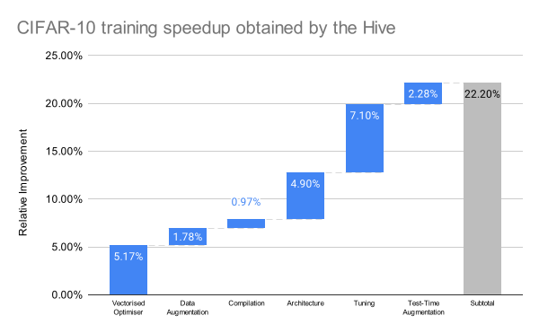

# CIFAR10-Speedrun

This repository contains a script that trains a neural network to **94% accuracy on CIFAR-10 in just 2.015 seconds** on a single NVIDIA A100 GPU. This new record beats the previous best of 2.59 seconds.

| Script | Mean accuracy | Time |
| :--- | :--- | :--- |
| **`cifar10_speedrun.py`** | **94.01%** | **2.015s** |
| `airbench94_muon.py` | 94.01% | 2.59s |

## 🚀 Quickstart

To run the speedrun, simply clone the repository and run the Python script.

```bash
git clone https://github.com/your-username/cifar10-speedrun.git
cd cifar10-speedrun
pip install -r requirements.txt
python cifar10_speedrun.py
```

This will download the CIFAR-10 dataset and run the training. The script requires `torch` and `torchvision`.

## Summary of changes

Below is a summary of the main changes that the Hive made from the [previous record](https://github.com/KellerJordan/cifar10-airbench) by Keller Jordan.



### Vectorised optimiser
The Muon optimiser was previously structured so that it updates every (matrix-valued) parameter in a for loop. The Hive makes this step faster by batching or vectorising these parameter update operations together. An issue that arises is that different parameters in this network can have different matrix dimensions. The Hive solves this problem by padding each matrix parameter to have the same dimension, so that all parameters can be stored in a single 3D torch tensor to perform vectorised operations on. The biggest benefit from these vectorised operations is being able to perform batched Newton Schulz operations, which requires us to perform a few matrix multiplications.
In addition, the optimiser no longer performs its normalisation routine at every update. Instead, these normalisations are applied periodically after a set number of steps, with the interval itself adapting to the progress of training. This reduces redundant computation while still keeping the parameter scales under control.

### Improved data augmentation
The previous implementation of batch_crop obtained various crops of the original images by iterating over possible crops using for loops in a sliding window-style approach. Similar to the vectorised optimiser operations, the Hive found a way to perform these crops in a fully vectorised fashion which avoids any for loops, allowing these operations to be performed faster.

The Hive also adds a new data augmentation method based on randomly varying the brightness and contrast of the training images. This results in improved validation accuracies for the same number of training steps.

### Compiled training step
The main forwards and backwards pass steps are moved into a function and compiled, which results in a slight speed improvement.

### Model architecture
The model's activation function was changed from GELU to SiLU, its init_whiten function was updated to use SVD instead of eigendecomposition, and its layers were set to use half-precision with a channels_last memory format. This adjustment reduced accuracy slightly.

### Tuning
Various hyperparameter changes (e.g., epochs, number of training steps, learning rates, momentum). Minor changes are also made to which float types and memory formats are used.

### Selective test time augmentation
Test time augmentation (TTA) is used to help improve the validation accuracy of a network by passing a number of augmented views of an input image through it then averaging the results. The Hive found that instead of performing TTA on every test image, we can retain the benefits of TTA while improving efficiency by only performing TTA on predictions which are below a certain confidence threshold, i.e., we first do a standard forwards pass of test images through the trained network, then perform TTA only on images whose predictions are below a set confidence threshold.
